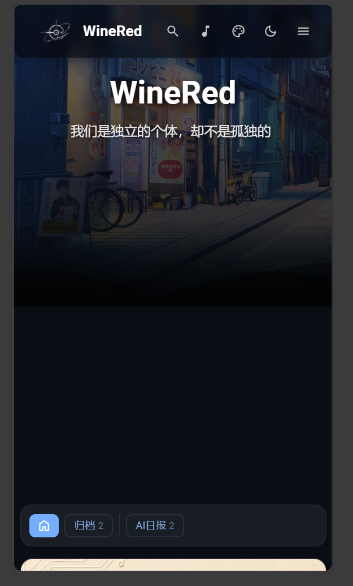

今天在调整博客模板时，遇到了一个移动端首页显示的样式 Bug，鉴于以前在做另外一个网站的主页时也遇见了同样的问题（虽然稀里糊涂的解决了），本次简短记录一下问题的排查和修复过程。

## 问题描述

在移动端访问博客主页时，正常的设计是：下方的文章内容区域应该向上偏移，盖住一部分上方的背景图片。但实际的表现却是，内容不仅没有盖住图片，两者之间反而出现了很大的黑色空隙。

<div style="max-width: 60%; margin: 0 auto; text-align: center;">




</div>

而当随便点击进入一篇文章或其它页面，然后再通过返回键回到主页时，这个空隙就消失了。

## 原因分析

经过排查 `src/styles/layout-styles.css` 样式文件，找到了问题的根源：

1. **写死的 CSS 绝对位置**：
   在针对移动端的媒体查询（Media Queries）中，之前为了适配不同屏幕高度，模板使用了类似 `top: 70vh !important`（或 80vh 等）的属性，强制规定了主内容区域的初始位置。

2. **与网格动画位移冲突**：
   内容网格本身为了实现平滑的入场动画，带有一个默认向下偏移 `translateY(30vh)` 的属性。当这两者在初次渲染时叠加（例如 `70vh + 30vh`），内容就被过度推到了屏幕最下方，从而在 Banner 和内容之间产生了巨大的黑边空隙。

3. **为什么切页后会恢复正常？**：
   因为博客使用了 SPA 机制的页面无刷新切换（Swup）。在路由切换时，JS 代码会介入接管页面渲染，将主内容元素的 `top` 属性重写为原本正确的设计值 `calc(var(--banner-height) - 3.5rem)`。这个内联样式的优先级更高，覆盖了 CSS 中错误的计算结果，所以再次返回主页时就恢复正常了。

## 解决方案

解决思路非常明确：**让 CSS 中的初始样式与 JS 最终计算的状态保持一致。**

我们将 `layout-styles.css` 中所有针对移动端首页导致错位的 `top: XXvh !important`，全部统一替换为了动态计算公式：

```css
body.enable-banner .absolute.w-full.z-30:not(.no-banner-layout):not(.mobile-main-no-banner) {
    /* 将原来的 top: 70vh !important 替换为统一的公式 */
    top: calc(var(--banner-height) - 3.5rem) !important; 
}
```

修改后，无论是初次进入首页，还是通过其他页面跳转返回，下方的内容都能正确且稳定地向上偏移（`3.5rem`），完美盖住一部分上方图片，问题彻底解决。

<div style="max-width: 60%; margin: 0 auto; text-align: center;">


</div>